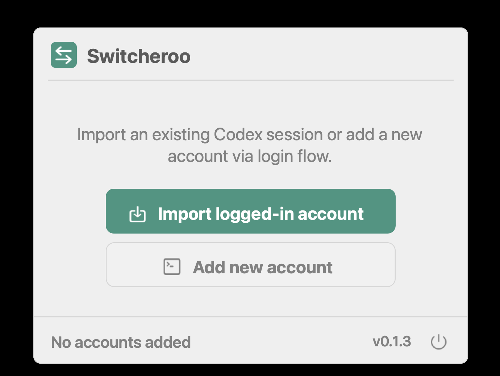
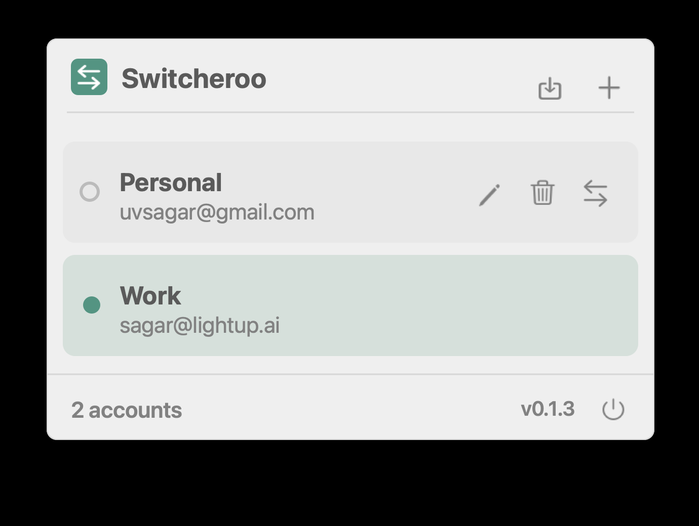
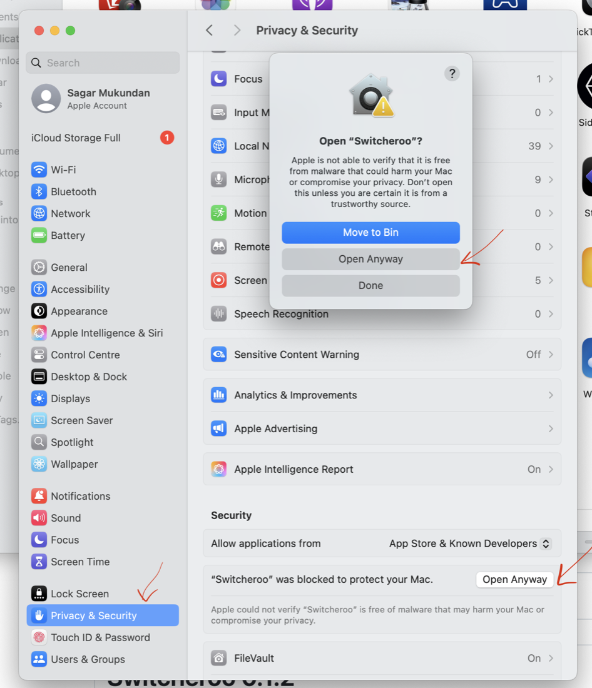

<p align="center">
  
</p>

<h1 align="center">Switcheroo</h1>

[](https://github.com/codeVerine/switcheroo/releases)
[](https://github.com/codeVerine/switcheroo/actions/workflows/ci.yml)


Native macOS menu bar app for managing and switching between your own Codex accounts.

Switcheroo stores each account's Codex auth snapshot in Keychain and swaps the active `~/.codex/auth.json` from a small menu bar UI. It also ships an optional CLI for scripting and development, but the packaged app is the primary experience.

> [!IMPORTANT]
> For Codex CLI and Codex App users, switch accounts, then restart the client for the new account to take effect.

Switcheroo is intentionally simple: it does not manage profiles, browser sessions, quotas, usage limits, or plan selection. It does not call OpenAI APIs. It just snapshots and swaps the active local `auth.json` used by the Codex app/CLI.

Not affiliated with OpenAI.

## Screenshots

<p align="center">
  
  
</p>

## Install

This repo is release-artifact first. The recommended install path is the packaged app from GitHub Releases.

1. Download the latest `Switcheroo-<version>-macos-arm64.dmg` from [Releases](https://github.com/codeVerine/switcheroo/releases).
2. Open the DMG and copy `Switcheroo.app` to `/Applications`.
3. Launch `Switcheroo.app`; it runs as a menu bar item.

### Opening on macOS

Switcheroo release builds are unsigned. If macOS blocks the first launch, open **System Settings → Privacy & Security**, find the Switcheroo security message, click **Open Anyway**, then confirm **Open Anyway** in the dialog.

<p align="center">
  
</p>

The optional CLI artifact is also available as `switcheroo-<version>-macos-arm64.tar.gz`.

> [!WARNING]
> This project uses OAuth account credentials and is intended for personal development use.
>
> By using this package, you acknowledge:
>
> - This is an independent open-source project, not an official OpenAI product.
> - You are responsible for your own usage and policy compliance.
> - The authors are not responsible for misuse or violations of OpenAI's terms of service.
> - For production or commercial workloads, use the OpenAI Platform API.

## Features

| Feature | What it does |
| --- | --- |
| Menu bar switching | Switch the active Codex account from a native macOS menu bar app. |
| Import existing login | Snapshot the account already logged in at `~/.codex/auth.json`. |
| Add account | Launch the official `codex login` flow in Terminal for another account. |
| Keychain storage | Store inactive auth snapshots as generic password items in macOS Keychain. |
| Snapshot refresh | Best-effort sync keeps known account snapshots fresh when Codex updates the active auth file. |
| Optional CLI | Use `list`, `current`, `import-current`, `add`, `switch`, `sync`, and `delete` from Terminal. |

## Boundaries

| Switcheroo does | Switcheroo does not |
| --- | --- |
| Manage local auth snapshots for accounts you control. | Monitor live usage limits or quotas. |
| Replace `~/.codex/auth.json` when you switch. | Refresh tokens itself. |
| Use local parsing for display metadata such as expiry. | Call OpenAI APIs. |
| Help avoid manual auth-file copying. | Share accounts, pool credentials, or bypass terms of service. |
| Keep account switching local to your Mac. | Work around service-wide Codex outages. |

## How It Works

1. Each account’s Codex `auth.json` is stored as an opaque blob in macOS Keychain.
2. “Switch” replaces the active `~/.codex/auth.json` atomically with the chosen snapshot.
3. Best-effort sync keeps known account snapshots up to date when the current `auth.json` matches an existing account. The menu bar app polls only near token refresh time; the CLI syncs once per command.

Docs:
- [Usage](/docs/USAGE.md)
- [Data & Security](/docs/DATA-AND-SECURITY.md)
- [Troubleshooting](/docs/TROUBLESHOOTING.md)
- [Architecture](/docs/ARCHITECTURE.md)
- [Development](/docs/DEVELOPMENT.md)

## Requirements

- macOS 13 (Ventura) or later
- `codex` CLI installed and working in your shell

## Build From Source

Run the menu bar app in development:
```bash
swift run SwitcherooMenuBar
```

Build the menu bar `.app` bundle:
```bash
./scripts/bundle_app.sh
open dist/Switcheroo.app
```

Build CLI (optional):
```bash
swift build -c release --product switcheroo
./.build/release/switcheroo list
```

Note: `dist/` is in `.gitignore` (it’s a local build artifact).

## GitHub Actions

- `CI` runs on pushes to `main` and pull requests.
- `Release` runs on `v*` tags and publishes:
  - `Switcheroo-<version>-macos-arm64.dmg`
  - `switcheroo-<version>-macos-arm64.tar.gz` (optional CLI)
- Release notes are generated automatically from git history at publish time.

## Data Locations

- Config: `~/Library/Application Support/Switcheroo/config.json`
- Keychain service: `com.switcheroo.codex` (one generic password item per account id)
- Codex active auth file (default): `~/.codex/auth.json` (Switcheroo swaps this)
- Logs: `log stream --predicate 'subsystem == "com.switcheroo"' --style compact`

## Package Layout

| Target | Role |
| --- | --- |
| `SwitcherooCore` | Provider-agnostic orchestration and protocols. |
| `SwitcherooPresentation` | Shared app state and actions. |
| `SwitcherooCodexProvider` | Built-in Codex adapter. |
| `SwitcherooMacAdapters` | macOS config, Keychain, and process integrations. |
| `SwitcherooDefaultApp` | Shared shell wiring. |
| `SwitcherooMenuBar` | Native macOS menu bar app. |
| `switcheroo` | Optional CLI frontend. |

## License

MIT. See [LICENSE](/LICENSE).
